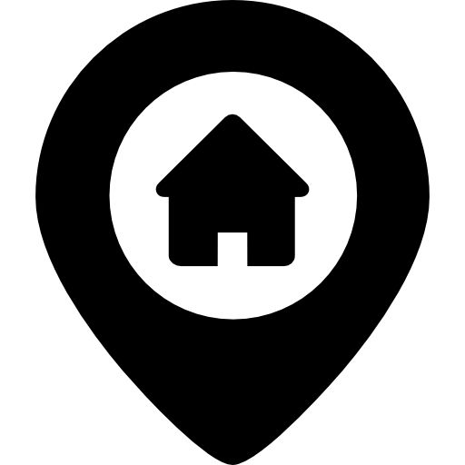

# Милана Чепикова

## Студентка БРУ

### Навигация
- [Образование](#образование)
- [Среднее Образование](#среднее-образование)
- [Навыки](#навыки)
- [Опыт работы][def]
- [О себе](#о-себе)

---

## Контактная информация

- +375257953497  
- milana_chepikova@mail.ru  
- ул. Калинина, д.8, кв.6 
- Дата рождения: 27.10.2005  
- Родной город: Чериков  

---

## Образование
БРУ, 2023-2027, Прикладная математика  

---

## Среднее Образование
ГУО "Средняя школа №1 г. Черикова"  
2012-2023, Средний балл: 9.6  

---

## Опыт работы
- Персональный сайт (CV) - [Ссылка на проект](#)  
  Навыки: HTML, Работа с разметкой, Основы веб-разработки  

---

## Навыки
1. Музыка  
2. Спорт  
3. Игры  

---

## Пример кода
def greet(name):
    return f"Привет, {name}!"

print(greet("Милана"))

---

## О себе
- Грамотна, ответственна, усидчива, неконфликтна.  
- Уровень английского языка: A2  

---

## Контакты
[Email: milana_chepikova@mail.ru](mailto:milana_chepikova@mail.ru)  

&copy; 2025 Милана Чепикова

[def]: #опыт-работы
